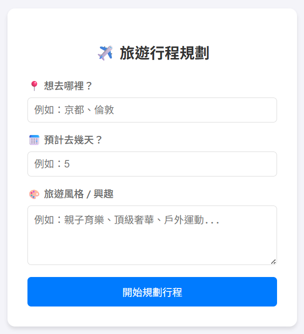
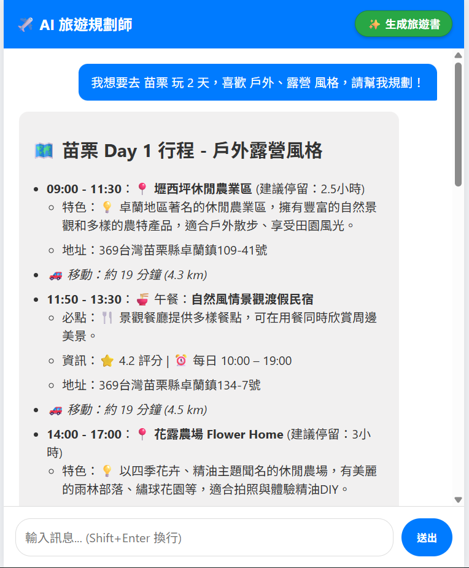
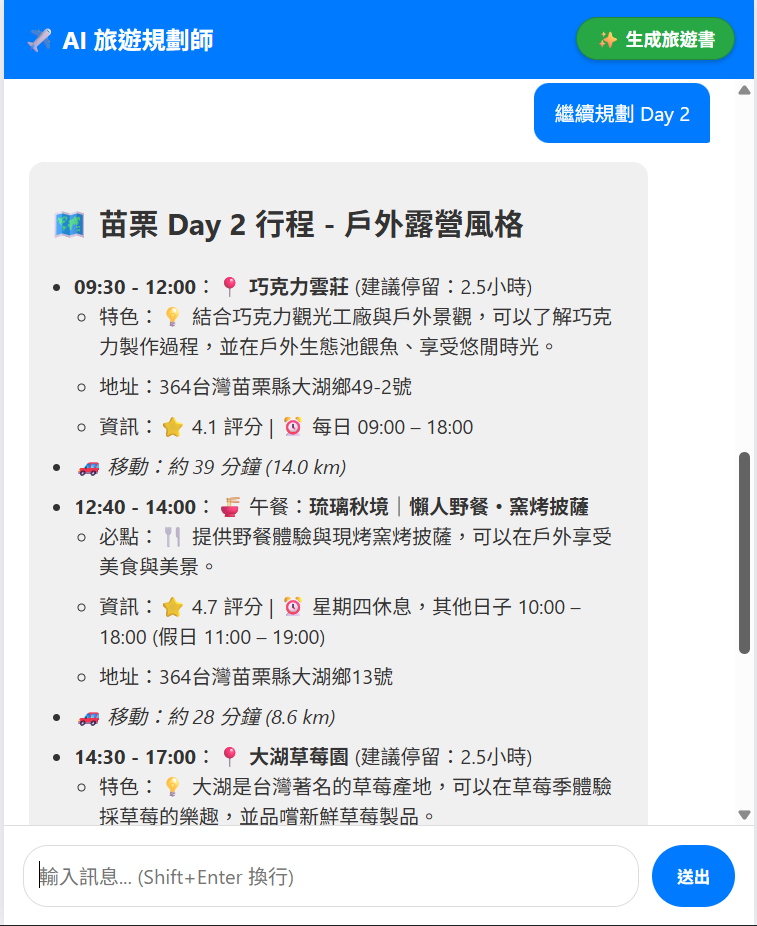
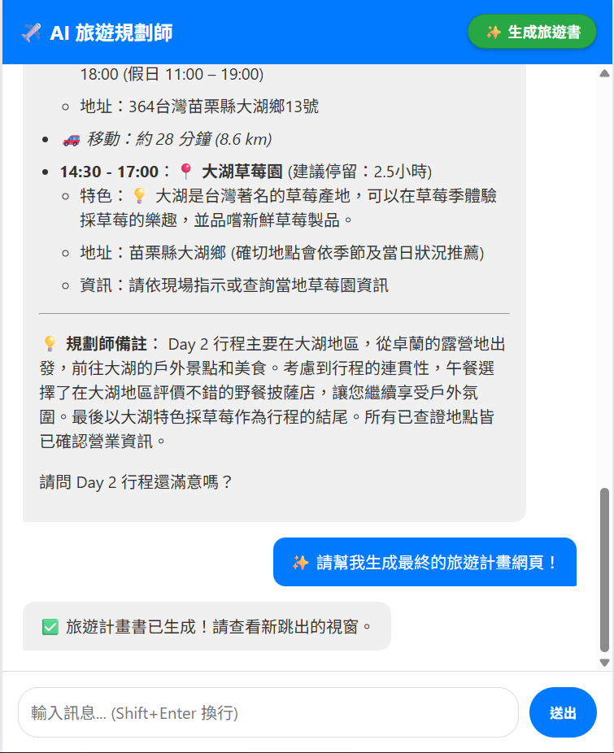
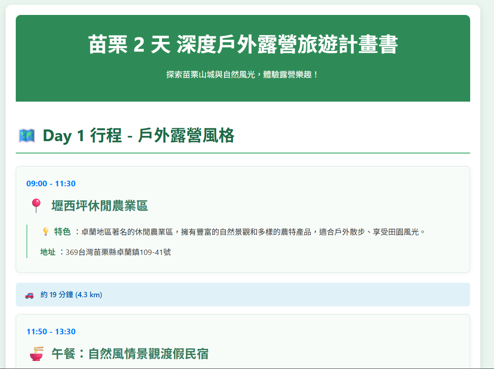
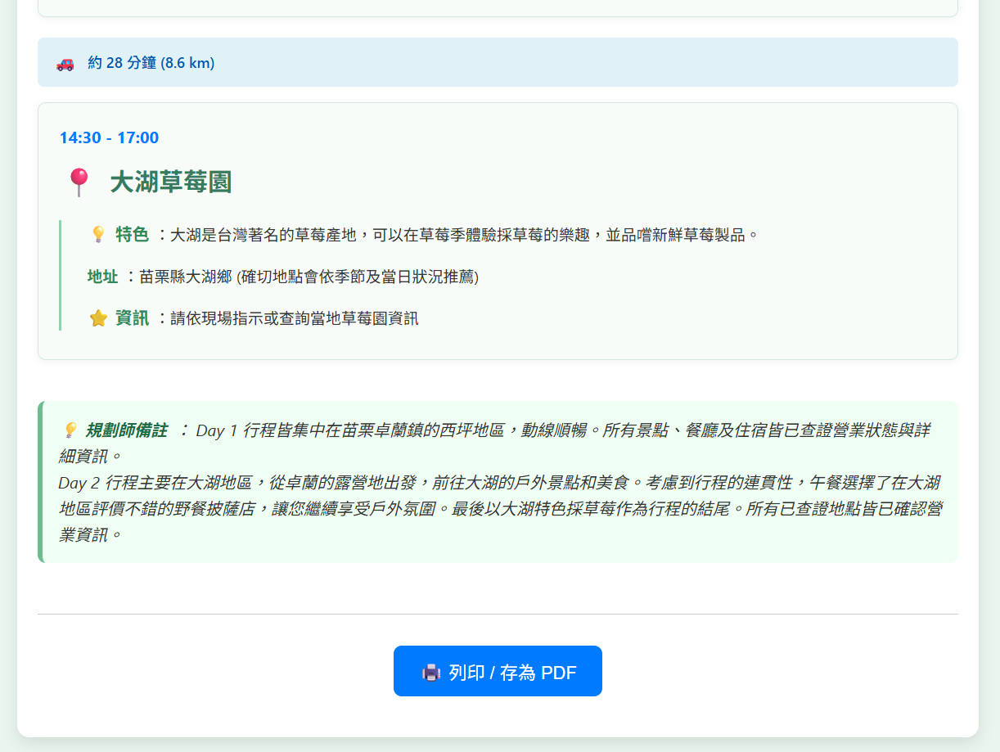

# ✈️ AI Travel Planner (n8n + Gemini)

> 一個基於 n8n、Google Gemini 與 Google Maps API 的全端 AI 旅遊規劃助手。強調資訊的「時效性」與「正確性」，並具備自動查證功能。

## ⚠️ 重要聲明 (Disclaimer)

由於本專案使用 Google Places/Maps API 進行真實地點查證，**每次對話皆會產生 API 費用**。因此，本專案 **不提供公開的 Live Demo 連結**。

請下載 JSON 檔案並使用您自己的 API Key 進行部署。這是一個為了「個人使用」與「自動化邏輯研究」而設計的專案。

## 📖 專案介紹 (Introduction)

許多 AI 在規劃行程時常會出現「幻覺」（推薦不存在的餐廳，或安排不順路的行程）。本專案透過 **ReAct (Reasoning and Acting)** 模式，讓 AI 擁有「查證」與「計算」的能力。

它不追求花俏的強化學習 (RL) 或過度複雜的架構，而是專注於 **「如何用最低的成本，解決最實際的旅遊規劃問題」**。它會主動呼叫 Google Maps 確認地點是否營業，並計算景點間的交通時間，最終生成一份可執行的旅遊計畫書。

### 💡 設計哲學 (Design Philosophy)
* **實用至上**：我們不使用昂貴的黑盒模型，而是使用免費額度友善的 **Google Gemini**。
* **證據導向**：沒有經過 Google Maps API 驗證的地點，不會出現在行程表上。
* **全端自動化**：不依賴 Vercel 或 Netlify，直接利用 n8n 的 Webhook 渲染前端介面。

## 🏗️ 技術架構 (Tech Stack)

本專案採用完全開源或提供免費層級 (Free Tier) 的服務搭建，適合開發者低成本復刻：

* **Workflow Engine**: [n8n](https://n8n.io/) (Self-hosted version)
* **Hosting**: [Hugging Face Spaces](https://huggingface.co/spaces) (Docker Space)
* **Backend Database**: [Supabase](https://supabase.com/) (PostgreSQL, 用於 n8n 狀態儲存)
* **LLM**: Google Gemini (PaLM)
* **Tools**: Google Custom Search API, Google Maps Platform (Places API)

## ✨ 核心功能 (Key Features)

1.  **🗺️ 實時查證 (Fact-Checking)**：自動過濾永久停業的店家，拒絕過時資訊。
2.  **🚗 智慧動線計算 (Smart Routing)**：內建距離計算機，估算景點間車程，避免「折返跑」。
3.  **💻 無伺服器前端 (Serverless UI)**：由 n8n 直接渲染 HTML/JS 聊天視窗，支援 Markdown。
4.  **📄 一鍵生成旅遊書 (HTML/PDF Export)**：規劃完成後，可一鍵匯出精美排版的行程表。

## 📸 專案展示 (Screenshots)

### 1. 需求輸入 (Landing Page)
* 簡單直覺的表單，設定地點、天數與風格。

### 2. 規劃與查證 (Chat Interface)
* AI 會分階段規劃，並顯示查證過程（不會一次吐出全部內容導致幻覺）。

### 3. 最終成果 (Final Itinerary HTML)
* 生成可列印的 HTML 旅遊書，包含詳細地址與交通資訊。

## ⚙️ 事前準備 (Prerequisites)

在匯入 Workflow 之前，請確保您擁有以下 API Keys：

1.  **Google Gemini API Key**
2.  **Google Custom Search API Key** & **Search Engine ID**
3.  **Google Maps Platform API Key** (需啟用 **Places API (New)**)

## 🚀 安裝與設定 (Installation)

### 1. 匯入 Workflow
下載本專案的 `Travel Planner.json`，並在您的 n8n 介面中選擇 "Import from File"。

### 2. 設定憑證
在 n8n 中設定 `Google Gemini(PaLM) Api account` 憑證。

### 3. 填入 API Keys (重要！)
為了保護隱私，Workflow 中的 Key 已被移除，請手動編輯以下節點的 JavaScript 代碼區塊：

* **Google Search 節點**：填入 `API_KEY` 與 `CX_ID`。
* **Google Places Details 節點**：填入 `API_KEY`。
* **5. 互動式聊天視窗 節點**：
    * 啟用 Workflow (Activate)。
    * 複製 **6. Agent manager 端點** 的 `Production URL`。
    * 將 URL 填入此節點代碼中的 `const API_URL = '...'`。

## 📄 License

[MIT](LICENSE)

